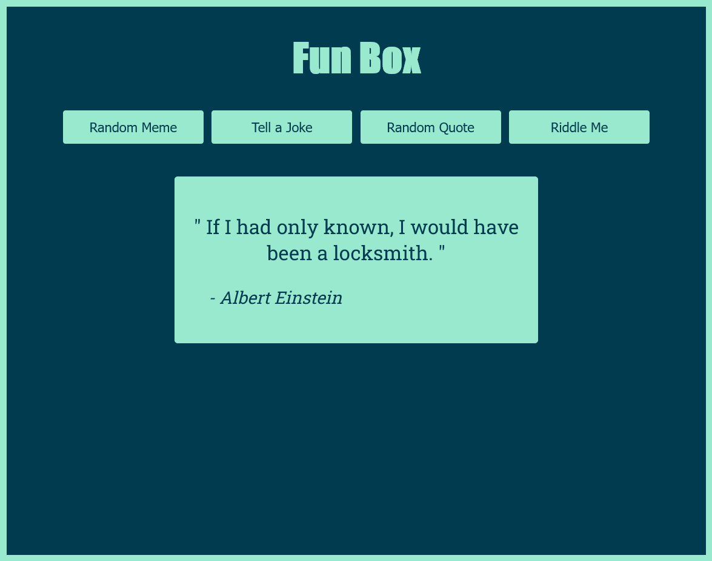
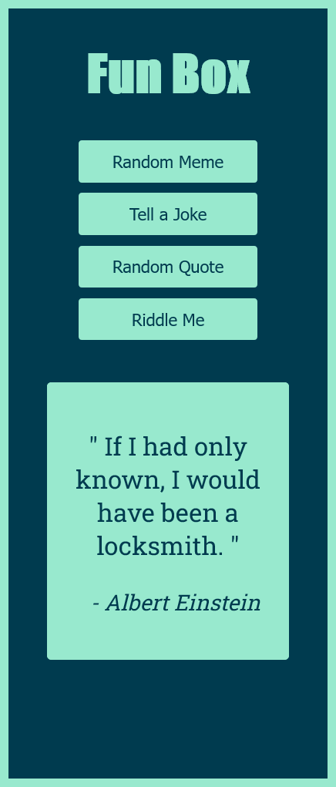

# FUN-BOX

This is a personal project. 
I got the inspiration for this project from [Zack Gollwitzer HTML and JS challange](https://codepen.io/zg_dev/pen/abBzvXv).

## Table of contents

- [Overview](#overview)
  - [The challenge](#the-challenge)
  - [Screenshot](#screenshot)
  - [Links](#links)
  - [Built with](#built-with)
  - [API used](#api-used)

## Overview

### The challenge

Users should be able to:

- View the optimal layout for the component depending on their device's screen size
- Random memes, quotes, jokes and ridlles with answers.

### Screenshot

- Desktop:

- Mobile:   

### Links

- Live Site URL: https://khalidmahamud.github.io/Fun-Box/

### Built with

- Semantic HTML5 markup
- CSS
- JavaScript
- Flexbox

 ### Api Used

- meme: https://api.imgflip.com/get_memes  
- joke: https://v2.jokeapi.dev/joke/Any  
- quote: https://api.quotable.io/random  
- riddle: https://riddles-api.vercel.app/random  

